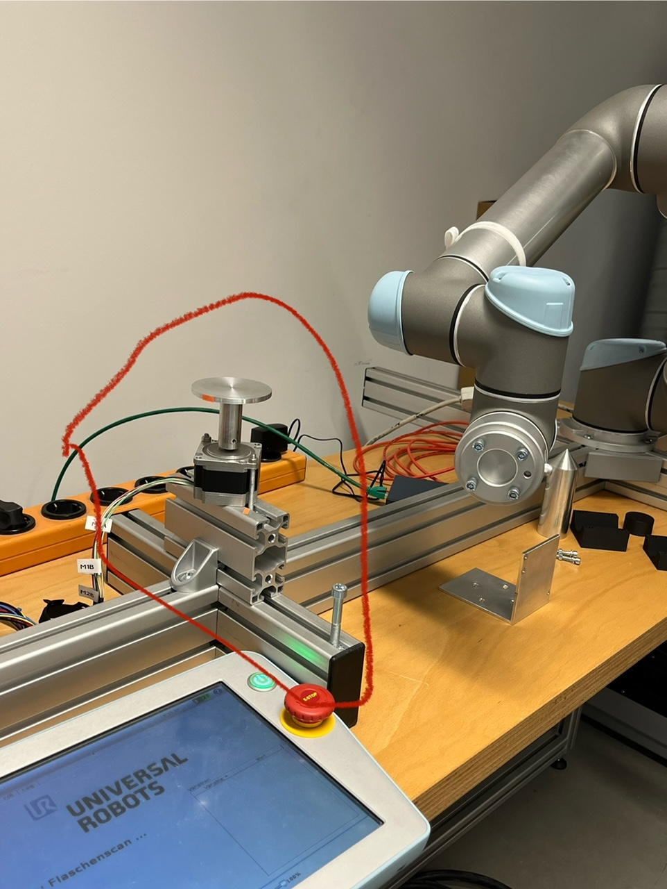
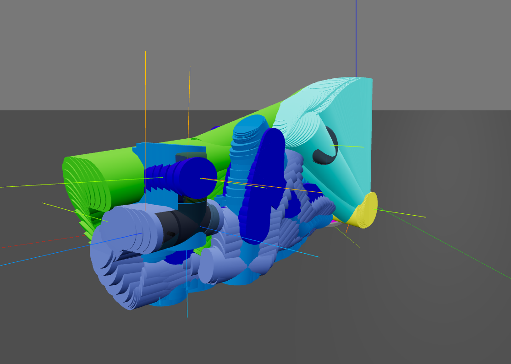
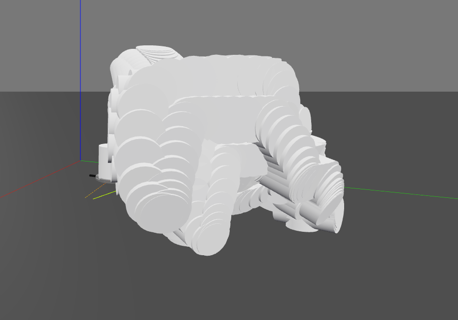
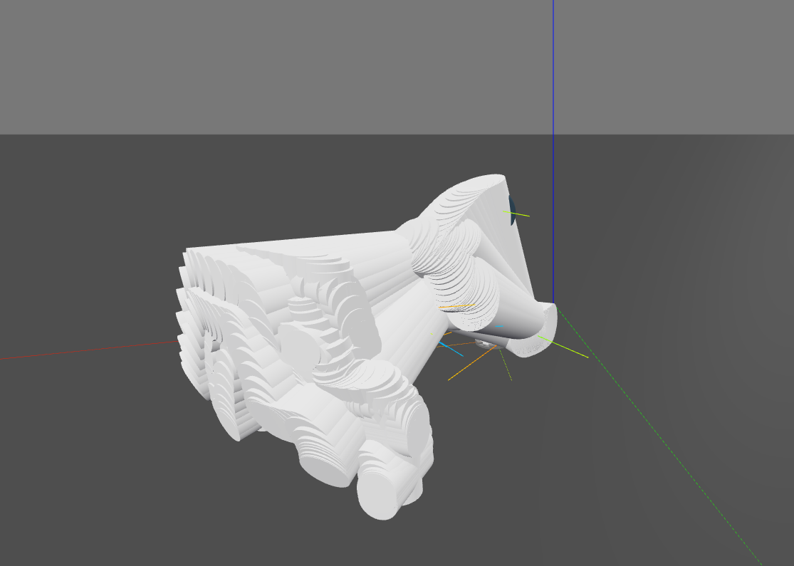
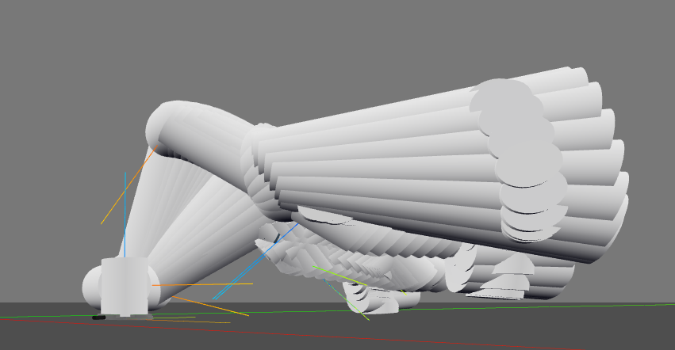

# Using Python's Robotics Toolbox



<div style='display: flex;'>
    
    
</div>

<div style='display: flex;'>
    
    
</div>

This repo uses different tools to visualize a robot. The robot is modeled with simple shapes like `spheres` and `cylinders`.
Based on the trajectory of the robot, these simple shapes are rendered within the visualization tool (`swift`).

`Openscad` is used to create a a single .stl file based on these overlapping shapes.
Therefore, first a `.scad` code file is created by a python library called `openpyscad`.
To generate an .stl file, it needs to be executed within the command line (if openscad is installed on the machine locally).

In my example, we use a docker container which executed the `.scad` code for us and saves the output as .stl file.

An example docker command looks like this:

```
docker run --rm -v ./scad_files:/input_files -v ./scad_output:/output_files openscad/openscad:latest openscad -o /output_files/test_output.stl /input_files/test.scad

or 

docker run --rm -v {cwd}/scad_files/:/scad_files/  openscad/openscad:latest openscad -o /scad_files/output.stl /scad_files/mesh.scad"
```

The second one is actually used in `mesh_generation.py`. One mount is used for transport the .scad file towards the container
and retrieve the generated .stl afterwards.

- `--rm` does remove the container afterwards
- `-v` mounts a volume. That defines a folder in the host machine to a path in the container's filesystem

## Setup

Create a new python env & activate

```
python3 -m venv env
source env/bin/activate
```

Clone & install `roboticstoolbox-python`

```
git clone https://github.com/petercorke/robotics-toolbox-python.git
cd robotics-toolbox-python
```

Fix import error of scipy according to [this issue](https://github.com/petercorke/robotics-toolbox-python/issues/412)
The error is, that scipy does not have a randn function (anymore). Therefore, the import statement needs to be changed to

    from numpy.random import randn

in the file ./robotics-toolbox-python/roboticstoolbox/mobile/EKF.py

Then, install it:

```
pip3 install -e .
```

## Usage

`move_robot.py` is the main script. To see available options, run


    python move_robot.py -h

To run the script in 'fake' mode, run 

    python move_robot.py -f 

This means, that no real robot is connected to extract the movement from; instead a simple movement is simulated.
To create an stl file out of this visualization (in the browser), add the -s flag like 

    python move_robot.py -f -s

Another example is 

    python move_robot.py -f -r 5 -d 2 -s 

Which launches the visualization without a real robot (-f: fake controller), a rate of 5 Hz (-r sampling rate of the joint states) and 
a duration of 2 seconds (-d). Also, the visualization is created as .stl file and saved at ./scad_files/output.stl
